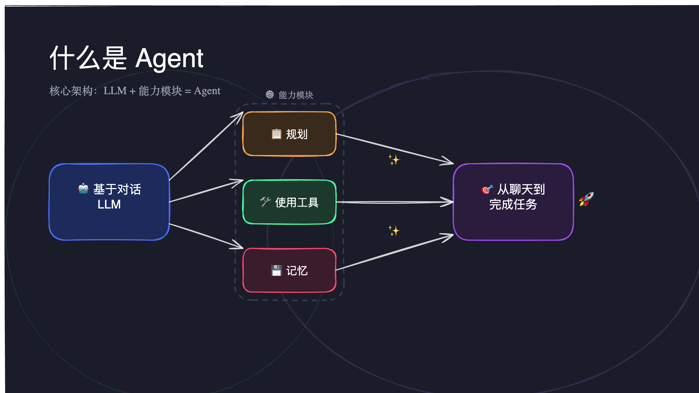
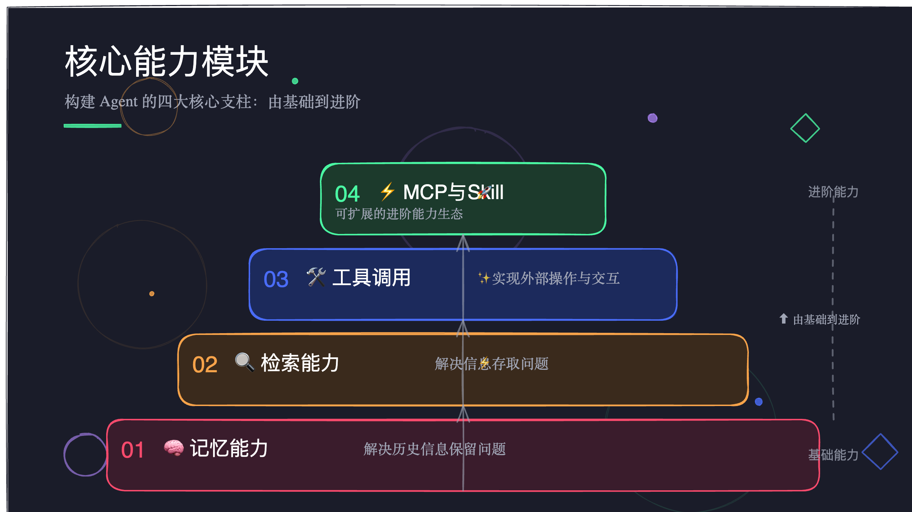
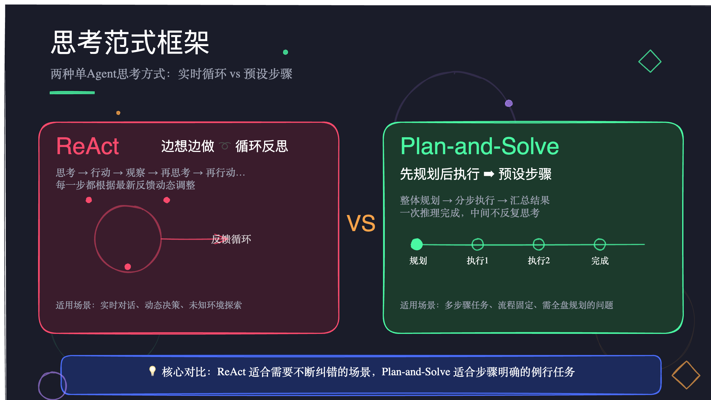
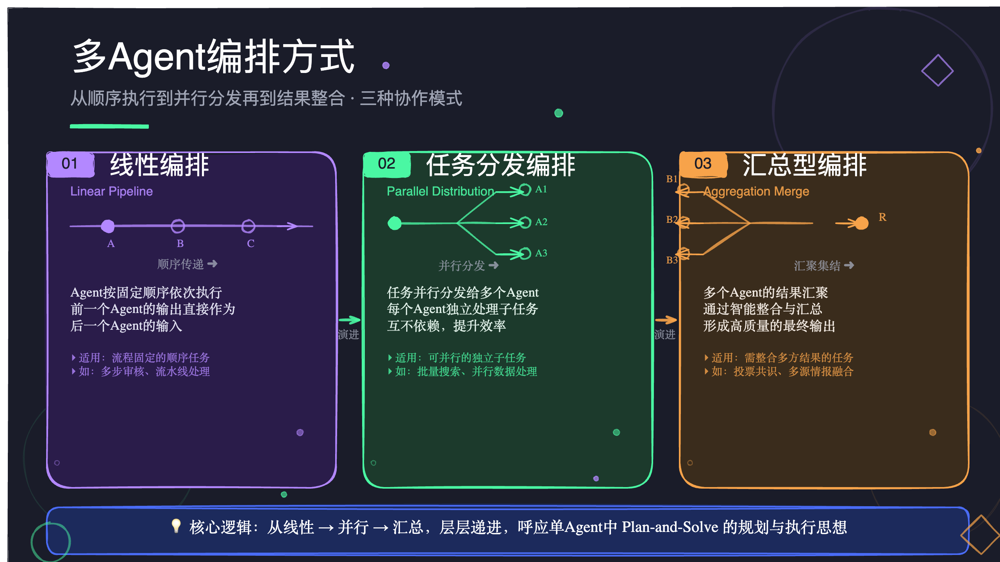
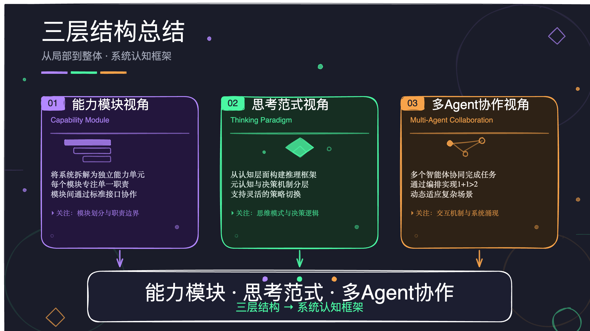

<div align="center">

# TalkDeck

**Say it. Ship the deck.**

把口述想法整理成演讲稿，并自动拆分成手绘风格的 PPT 页面。

<br />



<br />

<sub>Public Alpha · macOS-first · 需要自备 OpenAI-compatible LLM API Key</sub>

<br />
<br />


</div>

---

## TalkDeck 是什么

TalkDeck 是一个 voice-first 的 AI 演示文稿生成工具。你可以先把想法说出来，TalkDeck 会把口述内容整理成适合讲述的演讲稿，再自动分页，生成 Excalidraw 手绘风格的页面，并导出为 `.pptx`、`.excalidraw` 或 `.md`。

它不是传统模板式 PPT 工具。TalkDeck 更关注讲解型、知识型、结构型内容：尽量保留你的原始表达，再把它整理成能讲、能展示、能分享的一套演示稿。

## 效果预览

下面几张图来自同一段口述内容自动生成的演示页。完整示例见 [docs/assets/sample.pptx](docs/assets/sample.pptx)。

<table>
  <tr>
    <td></td>
    <td></td>
  </tr>
  <tr>
    <td></td>
    <td></td>
  </tr>
  <tr>
    <td colspan="2" align="center"></td>
  </tr>
</table>

## 核心流程

```text
口述输入 / 音频导入 / 文本输入
          ↓
本地 Whisper 转写
          ↓
LLM 整理演讲稿
          ↓
自动分页
          ↓
生成 Excalidraw 手绘图页
          ↓
导出 PPT / Excalidraw / Markdown
```

## 核心功能

- 录音、音频文件导入、文本直接输入。
- 本地 `whisper.cpp` 语音转文字。
- 轻度去口语化，保留用户原本表达。
- 自动生成演讲稿和页面大纲。
- 逐页生成 Excalidraw 风格幻灯片。
- 支持单页重生成、全部重生成、附带修改意见。
- Focus 模式中可直接微调 Excalidraw 元素，切回全局后自动保存。
- 导出 `.pptx`、`.excalidraw`、`.md`。

## 隐私与数据边界

TalkDeck 的目标是尽量把敏感内容留在本地。

- 录音文件和 Whisper 转写在本机完成。
- 项目数据存储在本机 SQLite 数据库中。
- LLM 整稿、分页、生成画布时，会把必要的文本 prompt 发送到你自己配置的 OpenAI-compatible 服务。
- TalkDeck 不内置任何云端账号或官方后端，也不内置 API Key。

请不要把你不希望第三方 LLM 服务看到的内容发送给远端模型。如果需要更强隐私，可以把 LLM Base URL 配置为本地或自部署的 OpenAI-compatible 服务。

## 快速开始

### 环境要求

- macOS 13+，Apple Silicon 推荐。
- Node.js 20+。
- pnpm 9+。
- Xcode Command Line Tools，用于编译 `whisper.cpp`。

### 安装依赖

```bash
git clone git@github.com:DjTaNg-404/TalkDeck.git
cd TalkDeck/app
pnpm install
```

### 准备本地 Whisper

```bash
bash scripts/setup-whisper.sh
```

脚本会克隆并编译 `whisper.cpp`，然后下载默认 `ggml-base.bin` 模型到 TalkDeck 的本地用户数据目录：

```text
~/Library/Application Support/TalkDeck/whisper/
```

你也可以选择更大的模型：

```bash
WHISPER_MODEL=small bash scripts/setup-whisper.sh
```

可选模型包括 `tiny`、`base`、`small`、`medium`、`large-v3`。

### 启动开发版

```bash
pnpm dev
```

首次打开后，在设置里填写：

- LLM API Base URL。
- LLM API Key。
- 模型名。
- Whisper CLI 路径和模型路径，使用脚本安装时通常可以自动检测。

## 导出能力

- `.pptx`：适合直接用 PowerPoint、Keynote 或 WPS 打开。
- `.excalidraw`：保留源文件，便于继续编辑。
- `.md`：导出演讲稿和页面结构，适合归档或继续写作。

## 技术栈

| 层 | 技术 |
| --- | --- |
| 桌面应用 | Electron 39 + electron-vite |
| UI | React 19 + TypeScript 5 + Tailwind CSS 4 |
| 画布 | @excalidraw/excalidraw |
| 本地存储 | better-sqlite3 |
| 语音转写 | whisper.cpp + ffmpeg-static |
| LLM | OpenAI-compatible Chat Completions API |
| 导出 | pptxgenjs + Excalidraw export |

## 当前限制

- 当前是 Public Alpha，优先保证 macOS 开发运行链路。
- Windows / Linux 打包尚未作为首发目标验证。
- 首次开源不提供未签名安装包，避免系统安全提示影响体验。
- 页面视觉质量依赖所选 LLM 模型能力。
- Whisper 模型下载和管理仍以脚本方式完成，后续会做进应用内设置页。

## Roadmap

- 应用内 Whisper 模型下载与管理。
- 更多演示风格预设。
- 更稳定的页面布局评估与自动修复。
- Windows / Linux 打包验证。
- GitHub Actions 自动检查与 release 构建。

## 贡献

欢迎 issue、建议和 PR。当前建议先从小修开始：

- README 和安装体验改进。
- 不同 LLM 服务的兼容性反馈。
- Excalidraw 生成质量改进。
- Windows / Linux 运行反馈。

本地检查命令：

```bash
cd app
pnpm check
```

## License

[MIT](LICENSE)
